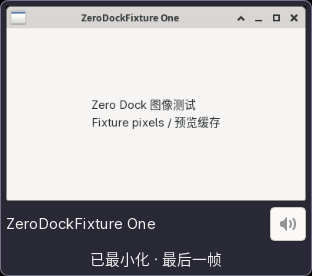

# Zero Dock

A native XFCE panel dock for X11, written in C and GTK 3. Each window gets its own icon: windows are never grouped.

[简体中文](README.zh-CN.md) · [Installation](docs/INSTALL.md) · [Contributing](CONTRIBUTING.md) · [Testing](docs/TESTING.md)

## Features

- Icon-only window buttons, with active, minimized and urgent indicators.
- Pinned application launchers, desktop actions and drag-and-drop reordering.
- Clickable live previews, with cached frames for minimized windows.
- Per-application mute and volume controls through PulseAudio or PipeWire-Pulse.
- Smooth wheel input through XInput2; 5% volume steps, capped at 200%.
- Workspace, maximize, fullscreen, always-on-top and close actions.
- Multiple independent instances, horizontal or vertical panels, and preview-aware auto-hide.
- An external XFCE plugin process: the dock runs separately from the panel.



The screenshot uses a synthetic test window. This is an early release; compatibility with every application, compositor and monitor configuration has not been established.

## Requirements

Linux, XFCE panel 4.20+, libxfce4windowing 4.20+, libxfce4ui 4.18+, GTK 3.24+, X11, and a PulseAudio-compatible audio server. Live previews require an X11 compositor. Wayland is not supported.

Build dependencies: a C11 compiler, Meson 0.63+, Ninja, pkg-config, GLib/GIO, libpulse, libX11, libXcomposite and libXi. Tests additionally require libXtst, Xvfb, xfwm4, D-Bus, Python 3 and `pacat`.

## Build and install

On Arch Linux / CachyOS:

```sh
sudo pacman -S --needed base-devel meson ninja xfce4-panel libxfce4ui   libxfce4windowing gtk3 glib2 libpulse libx11 libxcomposite libxi
meson setup build --prefix=/usr --libdir=lib -Dtests=false
meson compile -C build
sudo meson install -C build
```

A pacman package is preferred on Arch: see [packaging instructions](docs/INSTALL.md#arch-package). Other distributions need the corresponding development packages and XFCE versions. They have not all been tested.

Add **Zero Dock Window Dock** through **Panel → Add New Items**. Multiple instances keep separate settings. See [upgrade and removal](docs/INSTALL.md#upgrade-and-removal) for replacing an instance without restarting XFCE.

## Controls

| Target | Action |
|---|---|
| Window icon: left click | Activate, or minimize an already active window |
| Window icon: middle click | Launch another application instance |
| Window icon: wheel | Cycle through windows |
| Window icon: right click | Window actions, pinning and application mute |
| Speaker badge: click | Mute/unmute the application |
| Speaker badge: wheel | Change application volume in 5% steps |
| Preview image: click | Restore and activate the window |
| `.desktop` file: drag onto dock | Pin a launcher |
| Any button: drag | Reorder buttons |
| Empty space: right click | Show desktop, minimize all, and panel options |

The preview's speaker button also supports mute and scrolling. Preferences control previews, numbering, workspace filtering and reserved icon slots. Configuration lives at `~/.config/xfce4/panel/zero-dock-<instance-id>.rc`.

## Limitations

Audio is application-level. Browser windows that share an audio process may share their controls; this does not promise per-tab mute. Matching uses process ancestry first, then executable/window-class hints. Chromium and game wrappers depend on their actual process metadata.

A window minimized before the dock captured it has no preview frame until restored. Cached thumbnails stay in memory. Protected video content, all compositors, mixed-DPI layouts and long-term stability have not been comprehensively verified.

## Development

```sh
sudo pacman -S --needed libxtst xorg-server-xvfb xfwm4 python
meson setup build-dev --prefix=/usr --libdir=lib -Dtests=true --werror
meson compile -C build-dev
meson test -C build-dev --print-errorlogs
python tests/run-isolated.py build-dev
```

Integration tests use a private X server and D-Bus session, and adjust only audio streams they create. A running PulseAudio-compatible server and `pacat` are required. All validation is run locally; this repository does not use GitHub Actions.

See [architecture](docs/ARCHITECTURE.md), [verification scope](VERIFICATION.md), [release instructions](docs/RELEASING.md), and the [changelog](CHANGELOG.md).

## License

[MIT](LICENSE). Copyright © 2026 Zero Dock contributors.
